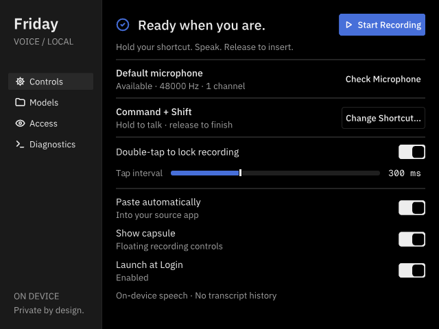

# Friday

### Think it. Say it. Keep going.

Private dictation for the app you're already using. Hold a shortcut, speak,
and release. Friday transcribes on your Mac and returns the final words to
where you started.

<p align="center">
  
</p>

<p align="center"><sub>Actual Friday renderer capture · deterministic ready-state fixture · dark appearance</sub></p>

**Apple Silicon · macOS 14+ · Local speech recognition · No transcript history**

## Made for the moment

- **Speak into your workflow.** Friday returns final text to the app where
  dictation began. If it can't safely paste there, it copies instead and tells you.
- **One shortcut, two ways to talk.** Hold to dictate, or double-tap to lock
  recording for a longer thought. Fn/Globe and custom combinations are supported.
- **Quietly available.** Friday lives in the menu bar. A small, movable capsule
  shows recording time and controls without taking focus from your work.
- **Your Mac does the listening.** Parakeet speech recognition runs locally.
  After model setup, dictation works offline. No cloud ASR, telemetry, or history.
- **A small app should fit.** Everyday controls share one compact window.
  Shortcut editing has its own focused dialog; access and model management have
  clear destinations.

## Get started

Friday currently installs from source with a local Apple signing identity.
You'll need an Apple Silicon Mac, macOS 14+, Xcode Command Line Tools,
[mise](https://mise.jdx.dev/), and an Apple Development signing identity in Keychain.

```sh
git clone https://github.com/phall1/friday.git
cd friday
mise install
mise run install-app
```

The task builds arm64-only, signs and verifies the app, then installs it in
`/Applications` (or `~/Applications` if needed). Re-running safely replaces the
installed copy. Node, Zig, and Bun are pinned in `mise.toml`; npm is the default
package manager. Use `FRIDAY_PM=bun mise run install-app` for Bun.

A public signed and notarized download is not available yet. Distribution
requirements are tracked in the [release checklist](docs/friday-release-checklist.md).

### First launch

1. **Grant access.** Microphone records your voice; Input Monitoring hears the
   global shortcut; Accessibility returns text to your source app. Friday shows
   which permissions are actually usable and offers recovery for each.
2. **Choose your shortcut.** Command + Shift is the default. Choose a preset or
   record Fn/Globe, an F-key, or a custom combination.
3. **Set up the local model.** Friday offers the verified Parakeet TDT 0.6B v3
   download (about 714 MB, 25 languages). Progress, cancellation, and retry are visible.
4. **Go back to your app and talk.** Hold your shortcut, speak, and release.

Closing the window keeps Friday in the menu bar. Click the mark for quick
Start/Stop/Cancel actions, or **Open Friday…** for Controls. Use **Quit Friday**
to exit. **Launch at Login** is in Controls.

## Private by design

Audio and recognition stay on this Mac. Friday stores no transcript history and
never sends speech to a cloud service. Temporary audio is deleted after a
completed, cancelled, dismissed, or superseded session; an explicit transcription
retry may retain only the current failed recording. The recording limit is
10 minutes, with a warning at 9:45.

Network access is limited to visible model discovery and download actions.
Friday verifies exact model identity, size, and SHA-256 before its in-process
runtime opens a model. Currently only the pinned default artifact is supported;
other Hugging Face repositories can be inspected as metadata, not installed
as arbitrary speech engines.

**Safe Diagnostics** excludes audio, transcript text, clipboard contents,
document names, and raw paths. Export is explicit.

[Read the user guide →](docs/friday-user-guide.md)

## Develop Friday

Friday uses a deterministic TypeScript core compiled by Native SDK, a pure-Zig
macOS host, and the NeMo Metal speech runtime. No JavaScript runtime ships.

```sh
mise exec -- npm ci --ignore-scripts
mise exec -- npx patch-package --error-on-fail
mise exec -- npm run check
mise exec -- npm run build
mise exec -- npm test
```

Run locally with `mise exec -- zig build -Dtarget=aarch64-macos run`.
Build a signed development bundle with
`FRIDAY_SIGN_IDENTITY="<Apple Development identity>" mise exec -- npm run package`.

### Visual verification

```sh
mise exec -- zig build -Dtarget=aarch64-macos -Dautomation=true
export FRIDAY_APP_BINARY="$PWD/zig-out/bin/friday"
tests/ui-automation.sh settings-dark
tests/ui-automation.sh settings-light
```

The state-preserving harness checks accessible names, keyboard traversal,
in-viewport controls, and reviewed PNG goldens. Close Friday before running it.
Use `--update <scene>` only after visual review. The README image comes directly
from the reviewed `settings-dark` capture.

### Project map

| Area | Start here |
| --- | --- |
| Product behavior and user stories | [PRODUCT](specs/friday/PRODUCT.md) · [UX](specs/friday/UX.md) |
| Visual language and layout constraints | [Design system](docs/design-system.md) |
| Core transitions and view projections | `src/core.ts` · `src/domain-transitions.ts` · `src/presentation.ts` |
| Native markup and deterministic fixtures | `src/app.native` · `src/automation.ts` |
| Audio, input, models, delivery, capsule | `native/friday_host.zig` · `native/macos/` |
| Architecture and runtime pins | [TECH](specs/friday/TECH.md) · [Module architecture](docs/module-architecture.md) |
| Quality and performance evidence | [ASR benchmark](docs/asr-quality-benchmark.md) · [Coverage](docs/friday-behavior-coverage.md) |
| Packaging and external validation | [Release checklist](docs/friday-release-checklist.md) |

Successful AX insertion and external-pointer capsule interaction still need
normal-GUI release validation; energy needs an Instruments measurement. The
release checklist records these separately from automated passes.
