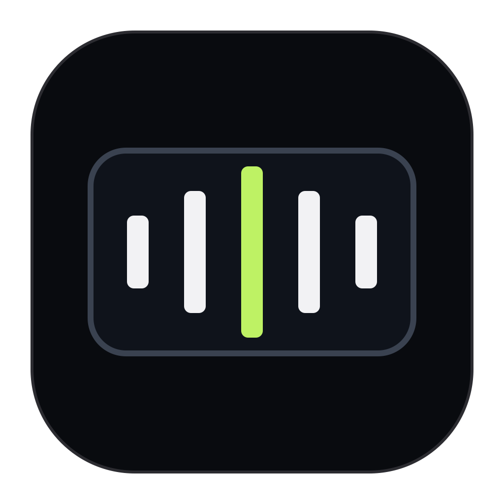

<p align="center">
  
</p>

<h1 align="center">Friday</h1>
<p align="center"><strong>Think it. Say it. Keep going.</strong></p>
<p align="center">Private dictation for the Mac app you're already using.</p>

<p align="center">
  <a href="https://github.com/phall1/friday/actions/workflows/ci.yml"></a>
  <br>
  Apple Silicon · macOS 14+ · Local speech recognition
</p>

<p align="center">
  <a href="#install">Install</a> ·
  <a href="#your-first-dictation">First dictation</a> ·
  <a href="docs/friday-user-guide.md">User guide</a> ·
  <a href="https://github.com/phall1/friday/issues">Get help</a>
</p>

Hold a shortcut, speak, and release. Friday turns your voice into text on your
Mac and returns it to where you were typing. Write a message, draft an email,
or get a thought out without breaking your flow.

<p align="center">
  
</p>
<p align="center"><sub>Friday's real interface, captured with demo data.</sub></p>

## A little less typing

- **Speak where you work.** Final text goes back to the app where you started.
  If automatic paste isn't available, Friday copies it and lets you know.
- **Hold for a sentence. Double-tap for a thought.** Use the default shortcut,
  Fn/Globe, or your own combination. Double-tap locks recording until you stop it.
- **Stay in the flow.** Friday lives in the menu bar, with a small movable
  recording capsule and a compact window for everyday controls.
- **Keep your words yours.** Speech recognition runs locally. After the model
  is downloaded, dictation works offline. No cloud transcription, telemetry,
  or transcript history.

## Install

**Friday is currently a source install for early adopters.** There isn't a public
signed and notarized download yet. The installer builds and signs Friday on your
Mac, then puts it in Applications.

### 1. Get your Mac ready

You'll need an **Apple Silicon Mac (M1 or newer)** running **macOS 14 or later**,
an internet connection for setup, and these tools:

| Requirement | How to get it |
| --- | --- |
| Xcode Command Line Tools | Run `xcode-select --install` in Terminal and finish the installer. If they're already installed, you're set. |
| [mise](https://mise.jdx.dev/getting-started.html) | With [Homebrew](https://brew.sh/), run `brew install mise`, or follow mise's installation guide. Friday uses it to install the right Node, Zig, and Bun versions. |
| Apple Development signing certificate | In **Xcode → Settings → Accounts**, add your Apple Account, select your team, open **Manage Certificates…**, then **+ → Apple Development**. This requires the full [Xcode app](https://developer.apple.com/xcode/), not just Command Line Tools. |

You can check that your signing certificate is ready with:

```sh
security find-identity -v -p codesigning
```

Look for an **Apple Development** identity. Friday needs it to sign the app and
its embedded speech libraries; the installer selects it automatically.

### 2. Build and install

Run these commands in Terminal:

```sh
git clone https://github.com/phall1/friday.git
cd friday
mise trust
mise install
mise run install-app
```

The first build can take a few minutes. When it finishes, open **Friday** from
Spotlight or Applications. The installer prints the exact location; if
`/Applications` isn't writable, it uses `~/Applications` instead.

## Your first dictation

1. **Grant access.** Setup walks you through Microphone (record your voice),
   Input Monitoring (hear your shortcut), and Accessibility (paste your words).
2. **Choose a shortcut.** The default is **Command + Shift**. You can change it
   during setup or later in **Controls → Change Shortcut…**.
3. **Download the speech model.** Friday offers **Parakeet TDT 0.6B v3**,
   supporting 25 languages. It's about **714 MB**, downloaded once and verified
   before use. You can cancel, retry, or resume the download.
4. **Try it in a text field.** Open Notes or your favourite editor, click where
   you want the words, hold **Command + Shift**, say a sentence, then release.
   Friday transcribes it locally and returns the final text.

For longer dictation, double-tap your shortcut to lock recording, then choose
**Stop Recording** when you're done. **Cancel** discards the recording.

Closing the window keeps Friday in the menu bar. Choose **Open Friday…** to
return to Controls, enable **Launch at Login** to keep it handy, or choose
**Quit Friday** to exit.

<details>
<summary><strong>Update an existing install</strong></summary>

From your Friday checkout:

```sh
git pull --ff-only
mise install
mise run install-app
```

The installer quits the running copy and replaces the app. Your settings and
downloaded model live separately from the app bundle.

</details>

<details>
<summary><strong>Installation or first-launch trouble?</strong></summary>

| What you see | What to do |
| --- | --- |
| `mise: command not found` | Finish [installing mise](https://mise.jdx.dev/getting-started.html), then open a new Terminal window. |
| An untrusted mise configuration | Run `mise trust` from the Friday checkout, then retry. |
| No Apple Development signing identity | Create the certificate in Xcode as above, then check `security find-identity -v -p codesigning`. To select a particular identity, run `FRIDAY_SIGN_IDENTITY="<identity hash>" mise run install-app`. |
| An Intel or Rosetta error | Friday requires Apple Silicon and a native Terminal session. Turn off **Open using Rosetta** for your terminal app. |
| The shortcut doesn't start recording | Open **Access** and check Input Monitoring, then confirm Friday is enabled in **System Settings → Privacy & Security**. |
| Words are copied instead of pasted | Check Accessibility access and **Paste automatically** in Controls. You can always paste copied text with **Command + V**. |
| The model download is interrupted | Return to the model setup page and choose **Resume Download** or retry. |

Still stuck? [Open an issue](https://github.com/phall1/friday/issues) with your
macOS version, the step that failed, and the error message. Friday's
**Diagnostics → Copy Diagnostics** provides a report without audio, transcript
text, clipboard contents, document names, or raw paths.

</details>

## Private by design

Your Mac does the listening and transcribing. Network access is limited to
visible model discovery and download actions; your speech never goes to a cloud
transcription service.

Friday keeps **no transcript history**. Temporary recordings are deleted after
success, cancellation, or dismissal. If transcription fails, only the current
recording may be kept for an explicit retry; dismissing it removes that audio.
Sessions have a 10-minute limit, with a warning at 9:45.

The default model is pinned and checked by identity, size, and SHA-256 before
use. Other Hugging Face repositories can be inspected, but arbitrary models
can't be installed as speech engines.

[Read the full user guide →](docs/friday-user-guide.md)

## Build with us

Bug reports, setup feedback, and thoughtful improvements are welcome.
[Tell us what worked and what got in your way](https://github.com/phall1/friday/issues).
For a larger change, start with an issue so we can agree on the shape of it.

Friday uses a deterministic TypeScript core compiled by Native SDK, a pure-Zig
macOS host, and the NeMo Metal speech runtime. No JavaScript runtime ships in
the app.

<details>
<summary><strong>Development commands</strong></summary>

After cloning and running `mise trust` and `mise install`:

```sh
mise exec -- npm ci --ignore-scripts
mise exec -- npx patch-package --error-on-fail
mise exec -- npm run check
mise exec -- npm run build
mise exec -- npm test
```

Run locally with `mise exec -- zig build -Dtarget=aarch64-macos run`.
Build a signed development bundle with
`FRIDAY_SIGN_IDENTITY="<Apple Development identity>" mise exec -- npm run package`.
The source installer defaults to npm; use `FRIDAY_PM=bun mise run install-app`
if you prefer Bun.

For visual verification, close Friday first, then run:

```sh
mise exec -- zig build -Dtarget=aarch64-macos -Dautomation=true
export FRIDAY_APP_BINARY="$PWD/zig-out/bin/friday"
mise exec -- tests/ui-automation.sh settings-dark
mise exec -- tests/ui-automation.sh settings-light
```

The state-preserving harness checks accessible names, keyboard traversal,
in-viewport controls, and reviewed PNG goldens. Use `--update <scene>` only
after visual review. [Screenshot provenance](docs/images/README.md).

</details>

### Around the project

| Looking for… | Start here |
| --- | --- |
| Product behavior and user stories | [Product spec](specs/friday/PRODUCT.md) · [UX spec](specs/friday/UX.md) |
| Visual language and layout | [Design system](docs/design-system.md) |
| Core transitions and UI state | `src/core.ts` · `src/domain-transitions.ts` · `src/presentation.ts` |
| Native markup and demo fixtures | `src/app.native` · `src/automation.ts` |
| Audio, input, models, and delivery | `native/friday_host.zig` · `native/macos/` |
| Architecture and runtime pins | [Technical spec](specs/friday/TECH.md) · [Module architecture](docs/module-architecture.md) |
| Quality and test coverage | [ASR benchmark](docs/asr-quality-benchmark.md) · [Behavior coverage](docs/friday-behavior-coverage.md) |
| Progress toward a public download | [Release checklist](docs/friday-release-checklist.md) |

Public distribution, normal-desktop paste and capsule validation, and energy
measurement are tracked in the release checklist.
